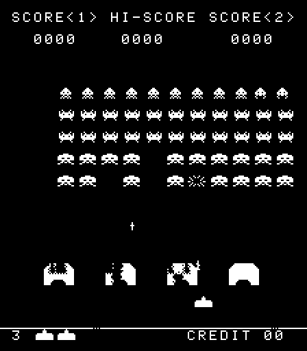

# rust-8080

## About

A WIP Intel 8080 emulator using Rust.

Not feature-complete yet, but can run space invaders.

## Controls

Add credit: C  
Start with 1 player: Q  
Start with 2 players: W  

Player 1:
- Left: A
- Right: D
- Fire: Space

Player 2:
- Left: Left arrow key
- Right: Right arrow key
- Fire: Enter

## Build options

Build with feature `logging` to enable step-by-step logging (very slow, should be built in release mode).

Build with feature `cpu_compare` to use a [modified version](https://github.com/alexandrejanin/i8080) of [i8080](https://github.com/XAMPPRocky/i8080) as a CPU reference, panicking on register/flag mismatch.
